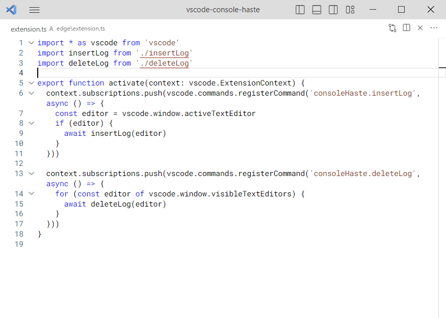
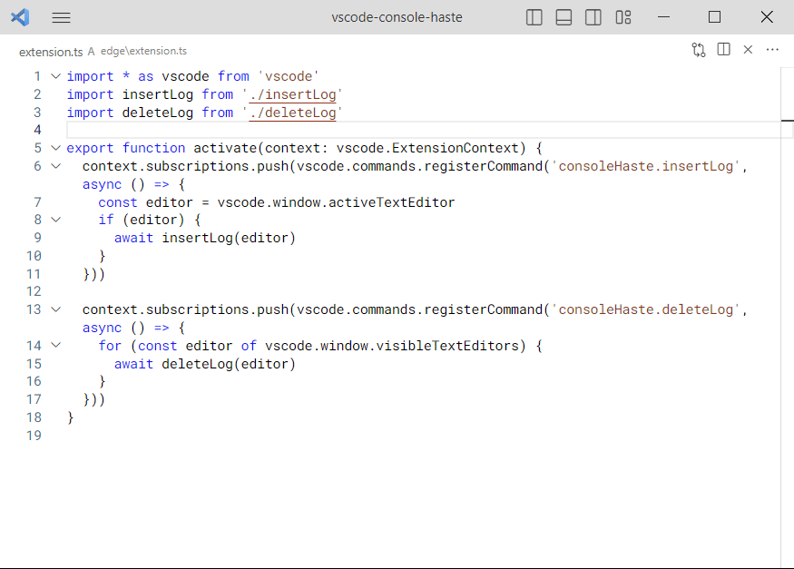
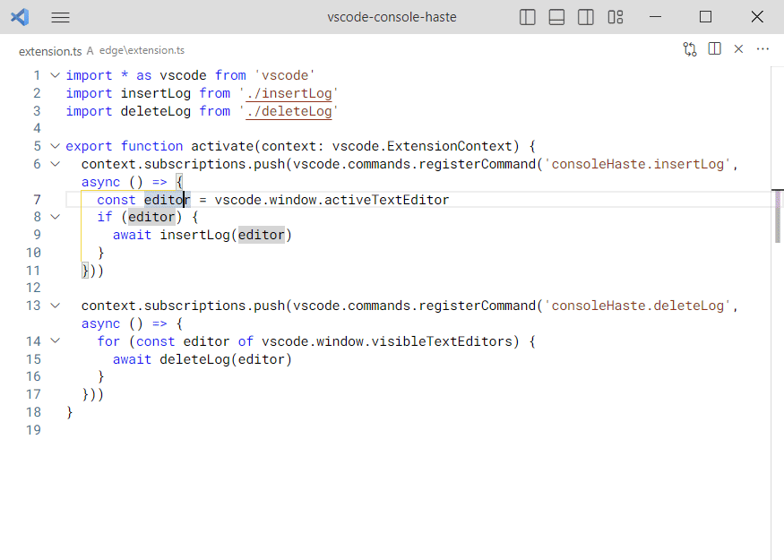
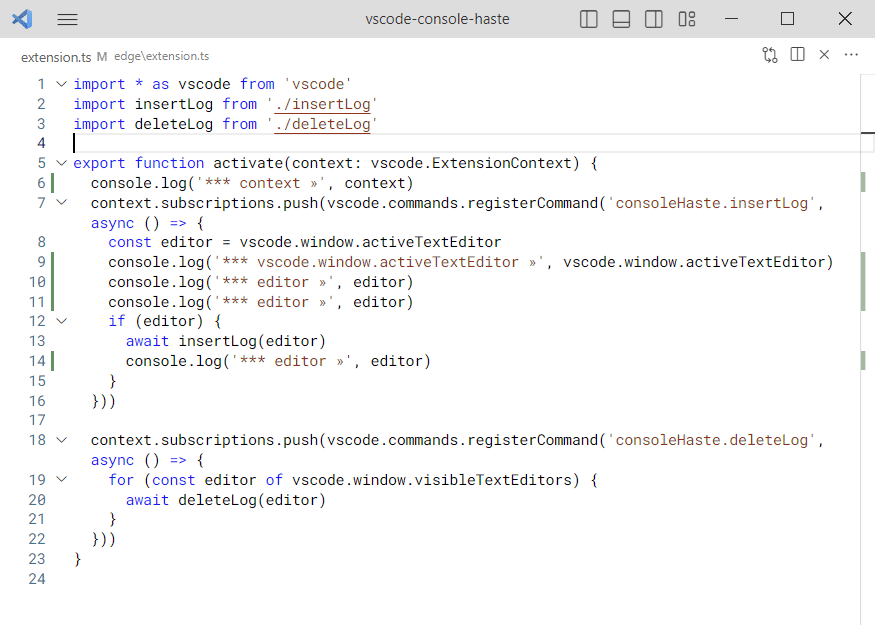

**Console Haste** is a Visual Studio Code extension that adds `console.log(...)` semantically for JavaScript and TypeScript.

When pressing **Alt+C** on an empty line, this will insert a `console.log('*** $1')` snippet.

When pressing **Alt+C** on a JavaScript expression, this will insert the `console.log('*** xyz »', xyz)` where `xyz` is an identifier or an expression.

This also works with multiple cursor selection.

When executing `consoleHaste.deleteLog` command, this will delete all `console.log(...)` that appear in _all visible text editors_.

